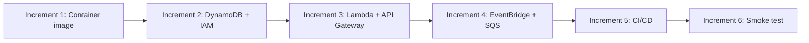

# Plan: AWS Lambda Deployment Infrastructure

**Source**: Epic F from `web-server-plan-r2-1.md` (§17.6, Stories F1–F4)  
**Date**: 2026-06-27  
**Estimated increments**: 6

## Summary

Build the deployment infrastructure to run the existing Lambda handlers on AWS. This includes a container image for Lambda packaging, AWS SAM templates for infrastructure-as-code, CI/CD pipeline for automated deployment, and end-to-end smoke testing.

## Current state

**Exists:**
- 3 Lambda handlers in `src/anki_deck_generator/lambda_handlers/`:
  - `handler_sync.py` — incremental sync (Mode A/B)
  - `handler_drive_webhook.py` — Drive push notifications
  - `handler_watch_renewal.py` — channel renewal
- DynamoDB state store (`state/dynamo_store.py`, `state/dynamo_table.py`)
- State factory (`get_store`) supporting SQLite and DynamoDB
- Settings with `state_backend` and `dynamodb_table_name` config
- Tests for DynamoDB store using `moto`

**Missing:**
- Container image / Dockerfile for Lambda
- SAM template or any IaC
- CI/CD deployment pipeline
- API Gateway configuration
- EventBridge rules
- SQS queues
- IAM roles and policies
- ECR repository
- Deployment scripts

## Target state

After this plan:
- `sam build && sam deploy` deploys the full stack to a personal AWS account
- Container image built and pushed to ECR
- DynamoDB table provisioned with correct schema
- API Gateway exposes Drive webhook endpoint
- EventBridge triggers scheduled sync and watch renewal
- SQS FIFO queue buffers webhook events
- GitHub Actions auto-deploys on merge to `main`
- Smoke test validates end-to-end flow

## Design decisions

| ID | Decision | Options considered | Tradeoffs | Status | ADR |
|----|----------|-------------------|-----------|--------|-----|
| D1 | AWS SAM for IaC | SAM / CDK / Terraform | SAM simplest for Lambda-native; CDK more flexible but heavier; Terraform cloud-agnostic but more setup | proposed | |
| D2 | Container image packaging | Container / Zip | Container avoids 250MB limit, better for CEDICT; slower cold start but acceptable for weekly runs | proposed | |
| D3 | Personal AWS account | Personal / Dev+Prod | Single account simplest for personal use; multi-account adds complexity without benefit at this scale | proposed | |
| D4 | DynamoDB for state | DynamoDB / SQLite on EFS | DynamoDB scale-to-zero, no idle cost; EFS always-on violates "no always-on" rule | proposed | |
| D5 | S3 for CEDICT storage | S3 / EFS / Lambda layer | S3 cheapest, acceptable cold-start cost; EFS always-on cost; Lambda layer size-limited | proposed | |
| D6 | API Gateway HTTP API | HTTP API / REST API | HTTP API cheaper ($1/M vs $3.5/M requests), sufficient for webhook; REST API has more features we don't need | proposed | |
| D7 | Custom domain for webhook | Custom domain / execute-api URL | Custom domain required for Google Search Console verification; execute-api URLs not verifiable | proposed | |

Plan-level notes:
- SAM template will be single-stack for simplicity
- Container image base: `public.ecr.aws/lambda/python:3.12`
- CEDICT loaded from S3 to `/tmp` on cold start, cached across warm invocations
- All secrets in AWS Secrets Manager, referenced by Lambda env vars
- CloudWatch alarms for DLQ depth, stuck pending edits, silent agents

### Increment 1 decisions

- D2: Container image chosen to handle CEDICT size and future dependency growth

### Increment 2 decisions

- D4: DynamoDB chosen for scale-to-zero and pay-per-request billing
- D5: S3 chosen for CEDICT to avoid EFS always-on cost

### Increment 3 decisions

- D1: SAM chosen for simplicity; CDK/Terraform documented as future options
- D6: HTTP API chosen for cost; REST API not needed
- D7: Custom domain required for Drive webhook verification

## Increments

### Increment 1: Lambda container image + bootstrap

**Goal (user-facing)**: Buildable container image that can run Lambda handlers locally via Docker.

**Scope**:
- [ ] Create `infra/lambda.Dockerfile` based on `public.ecr.aws/lambda/python:3.12`
- [ ] Install project dependencies (core + sync + google-drive + ankiweb + xlsx)
- [ ] Create `src/anki_deck_generator/lambda_handlers/bootstrap.py`:
  - Lazy-load Settings from environment
  - Initialize StateStore (DynamoDB)
  - Load CEDICT from S3 to `/tmp` with caching
  - Provide `get_settings()`, `get_store()`, `get_cedict()` helpers
- [ ] Update existing handlers to use bootstrap helpers
- [ ] Add `infra/README.md` with build/run instructions
- [ ] Test: `docker build -t anki-lambda -f infra/lambda.Dockerfile .`
- [ ] Test: `docker run -p 9000:8080 anki-lambda` + `curl` to Lambda Runtime Interface Emulator

**Tests**:
- Unit: bootstrap caches CEDICT across warm invocations (mock S3, assert called once)
- Unit: bootstrap handles missing CEDICT gracefully (returns None)
- Manual: build image, run locally, invoke handler via RIE

**MSR review?**: no — infrastructure setup, no complex logic

---

### Increment 2: SAM template — DynamoDB + IAM

**Goal (user-facing)**: `sam deploy` provisions DynamoDB table and IAM roles.

**Scope**:
- [ ] Create `template.yaml` (SAM template) with:
  - DynamoDB table matching `dynamo_table.py` schema (pk/sk, GSI card_by_key, PAY_PER_REQUEST, TTL)
  - S3 bucket for CEDICT storage
  - IAM execution role for Lambda:
    - DynamoDB read/write on table
    - S3 read on CEDICT bucket
    - Secrets Manager read on `anki-pipeline/*` secrets
    - CloudWatch Logs create/write
    - SQS send/receive (added in increment 4)
- [ ] Create `samconfig.toml` with parameter defaults
- [ ] Add Parameters section for:
  - `Environment` (dev/prod)
  - `CEDICTS3Key` (object key in bucket)
  - `GoogleDriveCredentialsSecretArn`
- [ ] Test: `sam validate`
- [ ] Test: `sam build && sam deploy --guided` to scratch account
- [ ] Test: verify table schema matches `dynamo_table_definition()`
- [ ] Test: `sam delete` removes all resources

**Tests**:
- Unit: `sam validate` passes
- Manual: deploy to scratch account, verify table exists with correct schema
- Manual: verify IAM role has least-privilege permissions

**MSR review?**: no — declarative infrastructure

---

### Increment 3: SAM template — Lambda functions + API Gateway

**Goal (user-facing)**: Lambda functions deployed and callable; API Gateway exposes webhook endpoint.

**Scope**:
- [ ] Add to `template.yaml`:
  - `SyncFunction` — handler: `handler_sync.handler`
    - Environment: `ANKI_PIPELINE_STATE_BACKEND=dynamodb`, `ANKI_PIPELINE_DYNAMODB_TABLE_NAME`, `ANKI_PIPELINE_CEDICT_S3_BUCKET`, `ANKI_PIPELINE_CEDICT_S3_KEY`
    - Timeout: 900s (15 min for long sync runs)
    - Memory: 1024 MB
  - `WebhookFunction` — handler: `handler_drive_webhook.handler`
    - Timeout: 30s
    - Memory: 256 MB
  - `RenewalFunction` — handler: `handler_watch_renewal.handler`
    - Timeout: 300s
    - Memory: 256 MB
  - API Gateway HTTP API:
    - `POST /drive/notifications` → `WebhookFunction`
    - Custom domain configuration (ACM cert + Route 53)
    - Domain name parameter: `DriveWebhookDomain`
- [ ] Add Outputs:
  - `WebhookUrl` — full URL for Drive watch registration
  - `SyncFunctionArn` — for manual invocation
  - `ApiGatewayId` — for custom domain setup
- [ ] Test: `sam local start-api` serves `/drive/notifications` locally
- [ ] Test: `sam local invoke SyncFunction` with test event
- [ ] Test: deploy to AWS, invoke `SyncFunction` manually via console, check CloudWatch Logs

**Tests**:
- Unit: `sam local invoke` with mock event succeeds
- Integration: `sam local start-api` + `curl POST /drive/notifications` returns 200
- Manual: deploy to AWS, invoke manually, verify logs

**MSR review?**: no — declarative infrastructure

---

### Increment 4: SAM template — EventBridge + SQS + DLQ

**Goal (user-facing)**: Scheduled sync runs automatically; webhook events buffered in queue; failures captured in DLQ.

**Scope**:
- [ ] Add to `template.yaml`:
  - SQS FIFO queue `DriveChangeQueue`:
    - `FifoQueue: true`
    - `ContentBasedDeduplication: true`
    - `VisibilityTimeout: 900s` (match Lambda timeout)
    - Redrive policy → DLQ after 3 attempts
  - SQS FIFO DLQ `DriveChangeDLQ`
  - EventBridge rule `ScheduledSyncRule`:
    - Schedule: `cron(0 0 ? * * *)` (daily at midnight UTC)
    - Target: `SyncFunction` with input `{"trigger": "schedule"}`
  - EventBridge rule `WatchRenewalRule`:
    - Schedule: `rate(1 day)`
    - Target: `RenewalFunction`
  - EventBridge rule `PendingEditsTickRule`:
    - Schedule: `rate(1 minute)`
    - Target: `SyncFunction` with input `{"trigger": "pending_tick"}`
  - Update `SyncFunction` events:
    - SQS event source: `DriveChangeQueue` (batch size 1, FIFO)
  - Update `WebhookFunction`:
    - Add SQS send permission to execution role
    - Environment: `DRIVE_CHANGE_QUEUE_URL`
  - CloudWatch alarms:
    - `DLQDepthAlarm` — DLQ depth > 0 for 5 min
    - `PendingEditsAgeAlarm` — pending edits age > 2× max_delay_minutes
- [ ] Update `handler_drive_webhook.py` to enqueue to SQS instead of direct call
- [ ] Update `handler_sync.py` to handle SQS event source (Mode A) vs EventBridge (Mode B)
- [ ] Test: `sam local generate-event sqs receive-message` → invoke `SyncFunction`
- [ ] Test: deploy to AWS, trigger webhook, verify SQS message → Lambda invocation

**Tests**:
- Unit: handler parses SQS event correctly
- Unit: handler distinguishes EventBridge schedule vs pending_tick
- Integration: local SAM + mock SQS → Lambda invocation
- Manual: deploy, trigger webhook, verify end-to-end flow

**MSR review?**: yes — event-driven architecture, failure modes

---

### Increment 5: CI/CD pipeline

**Goal (user-facing)**: Merge to `main` auto-deploys to AWS; PRs run tests.

**Scope**:
- [ ] Create `.github/workflows/deploy.yml`:
  - Trigger: push to `main`
  - Steps:
    1. Checkout code
    2. Setup Python 3.12
    3. Install SAM CLI
    4. Configure AWS credentials (OIDC or access keys from secrets)
    5. `sam build`
    6. `sam deploy --no-confirm-changeset`
  - Environment: `production`
  - Secrets: `AWS_ACCESS_KEY_ID`, `AWS_SECRET_ACCESS_KEY`, `AWS_REGION`
- [ ] Create `.github/workflows/test.yml`:
  - Trigger: pull_request
  - Steps:
    1. Checkout code
    2. Setup Python 3.12
    3. `pip install -e ".[dev,sync,google-drive,ankiweb,server]"`
    4. `pytest -q`
    5. `ruff check src/ tests/`
    6. `ruff format --check src/ tests/`
- [ ] Create `.github/workflows/weekly-sync-fallback.yml`:
  - Trigger: schedule `cron(0 0 ? * FRI *)`
  - Steps:
    1. Checkout code
    2. Build container image
    3. Run container with `anki-notes-pipeline schedule` command
    4. Secrets from GitHub secrets
- [ ] Add `README.md` section: "Deployment" with CI/CD explanation
- [ ] Test: push to feature branch, verify test workflow runs
- [ ] Test: merge to `main`, verify deploy workflow runs

**Tests**:
- Manual: PR triggers test workflow
- Manual: merge to `main` triggers deploy workflow
- Manual: scheduled workflow runs on cron

**MSR review?**: no — CI/CD configuration

---

### Increment 6: End-to-end smoke test

**Goal (user-facing)**: Scripted test validates full deployment works end-to-end.

**Scope**:
- [ ] Create `tests/e2e/lambda-smoke-test.sh`:
  1. Check prerequisites: AWS CLI, SAM CLI, Docker, Google Drive credentials
  2. `sam build && sam deploy --guided` to scratch account
  3. Upload test CEDICT to S3 bucket
  4. Seed test Google Drive folder with sample Google Doc
  5. Register Drive watch channel via CLI
  6. Edit the Google Doc
  7. Wait for webhook → SQS → Lambda Mode A
  8. Wait for EventBridge tick → Lambda Mode B
  9. Verify DynamoDB has expected `CardRecord`s
  10. Verify CloudWatch Logs show successful run
  11. `sam delete` to clean up
- [ ] Add `tests/e2e/README.md` with:
  - Prerequisites
  - How to run
  - Expected output
  - Troubleshooting
- [ ] Add to `README.md`: link to E2E test docs
- [ ] Test: run smoke test manually on laptop with test AWS account

**Tests**:
- Manual: smoke test runs clean on fresh environment
- Manual: teardown leaves no orphaned resources

**MSR review?**: no — test script

## Runtime verification

**Surface**: cli + api  
**Claim**: Deployed Lambda stack processes Drive webhooks and scheduled syncs correctly.

**Scenarios**:
- [ ] Manual `sam local invoke SyncFunction` with test event produces expected output
- [ ] Deployed stack: Drive webhook → SQS → Lambda Mode A → DynamoDB pending edits
- [ ] Deployed stack: EventBridge tick → Lambda Mode B → DynamoDB card records
- [ ] Deployed stack: scheduled sync runs daily without manual intervention
- [ ] CI/CD: merge to `main` auto-deploys without errors

**Suggested method**:
```bash
# Local testing
sam build
sam local invoke SyncFunction -e tests/fixtures/lambda-event.json
sam local start-api

# Deploy to AWS
sam deploy --guided

# Verify deployment
aws lambda invoke --function-name SyncFunction --payload '{"trigger":"schedule"}' out.json
aws logs tail /aws/lambda/SyncFunction --follow

# Clean up
sam delete
```

## Dependency graph



Increments 1–4 are sequential (each builds on previous). Increment 5 can start after increment 4. Increment 6 requires all previous.

## Risks and mitigations

| Risk | Mitigation |
|------|------------|
| Cold start latency >10s with CEDICT load | Lazy-load CEDICT only when enrichment enabled; cache in `/tmp` across warm invocations; consider pre-parsed pickle to skip parse time |
| Google Search Console domain verification fails | Document manual verification process; provide Route 53 TXT record instructions |
| DynamoDB table schema drift from `dynamo_table.py` | Use `dynamo_table_definition()` output as source of truth; add test comparing deployed table schema |
| CI/CD secrets leak | Use GitHub OIDC provider for AWS auth instead of long-lived access keys; rotate secrets regularly |
| Lambda timeout on long sync runs | Set timeout to 900s (max); chunk large syncs into multiple invocations if needed |
| SQS message loss on Lambda failure | DLQ captures failures; CloudWatch alarm on DLQ depth; manual replay via `aws sqs receive-message` |
| Custom domain ACM cert validation delays | Document 24-48h validation window; use DNS validation for faster approval |

## Out of scope

- Multi-region deployments (personal use, single region sufficient)
- Blue/green or canary deployments (overkill for personal project)
- Production HTTPS without custom domain (Drive requires verified domain)
- Lambda@Edge or CloudFront (not needed for webhook endpoint)
- Step Functions orchestration (EventBridge + SQS sufficient)
- X-Ray tracing (CloudWatch Logs sufficient for debugging)
- Provisioned concurrency (violates scale-to-zero; cold start acceptable for weekly runs)

## Verification

- [ ] All increments have tests defined
- [ ] CI commands identified: `pytest -q`, `ruff check`, `sam validate`
- [ ] Each increment deliverable maps to Epic F stories (F1–F4)
- [ ] Container image builds under 2 GB
- [ ] `sam deploy` succeeds on clean AWS account
- [ ] `sam delete` removes all resources
- [ ] Smoke test validates end-to-end flow

## Future options (not in this plan)

- **AWS CDK migration**: If infrastructure grows beyond SAM's comfort zone (multi-stack, complex networking), migrate to CDK. SAM template can be exported to CloudFormation and imported into CDK.
- **Terraform**: If multi-cloud or team collaboration requires it, Terraform provides cloud-agnostic IaC. Existing SAM template documents the resource graph.
- **Multi-account setup**: If security or compliance requires, split into dev/staging/prod accounts with AWS Organizations and cross-account IAM roles.
